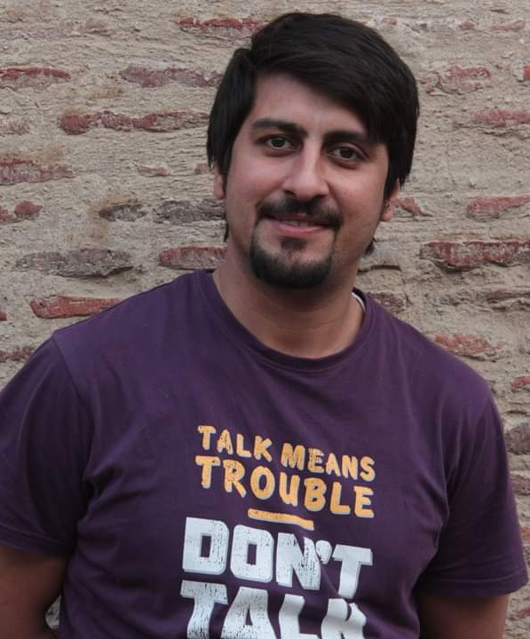

<!---

-->
## Dr. Mehtab Alam Syed

**Postdoctoral Researcher, CIRAD, Montpellier, France**  
Email: [mehtab_alam.syed@cirad.fr](mailto:mehtab_alam.syed@cirad.fr)  
[GitHub](https://github.com/mehtab-alam) | [Google Scholar]([https://scholar.google.com/](https://scholar.google.fr/citations?user=AH5zXb4AAAAJ&hl=en&oi=ao)) | [LinkedIn](https://www.linkedin.com/in/syed-mehtab-alam-b4564a30/)

---

## About Me

I am a postdoctoral researcher at CIRAD, Montpellier, specializing in AI, machine learning, remote sensing, and geospatial analysis for food security and epidemiology. My work integrates satellite imagery, data science, and natural language processing (NLP) to tackle real-world challenges in agriculture, health, and environmental informatics.

---

## Research Interests

- Food Security Prediction
- Deep Learning & Machine Learning
- Remote Sensing & Image Analysis
- NLP & Text Mining
- Disease Surveillance
- Open Data & GIS

---

## Current Projects

**Forecasting Food Security in Africa**  
Developed multimodal deep learning models (CNN/LSTM) integrating satellite, news, socio-economic, and climate data for sub-national food security classification ([DIGITAG Project]).

**GeoXTag & GeospaCy**  
Advanced spatial text mining tools for geographical entity extraction and geocoding from unstructured textual data, used in epidemiological event monitoring.

---

## Selected Publications

- Syed, M.A., et al. (2025). "Data quality assessment approaches for event-based surveillance systems." *Journal of Data Intelligence*. DOI: 10.3724/2096-7004.di.2025.0063
- Arınık, N., et al., (2023). "An annotated dataset for event-based surveillance of antimicrobial resistance." *Data in Brief* 46.
- Syed, M.A. et al. (2023). "Geospatre: Extraction and geocoding of spatial relation entities..." *Cartography and Geographic Information Science*. DOI: 10.1080/15230406.2023.2264753.
- [More on Google Scholar](https://scholar.google.com/)

---

## Talks & Conferences

- **2023:** MOOD Summer School Croatia – Risk Mapping Dashboard for Outbreak Surveillance [[video](https://doi.org/10.5446/62453)]
- **2022:** MOOD Summer School France – Early Detection of Outbreaks from Media Data [[video](https://doi.org/10.5446/13748)]
- **Living Planet Symposium 2025:** Forecasting Food Security in Africa

---

## Experience

**2024–Present:** Postdoc, CIRAD–UMR TETIS, Montpellier, France  
- Led framework for food security prediction (DIGITAG)  
- Supervised Master’s students, fostered collaborations

**2021–2023:** PhD Researcher, CIRAD (EU H2020 MOOD Project)  
- Developed/teached NLP and geospatial analytics for surveillance

**2018–2020:** Research Assistant, Free University of Bolzano  
**2016–2018:** Software Development Lead, AbsolulT, Islamabad  
**2011–2014:** Lecturer, Arid Agriculture University, Pakistan

---

## Education

- **Ph.D. Computer Science**, University of Montpellier (2023)
- **M.S. Computer Science**, Bahria University (2017)
- **B.S. Computer Science**, Muhammad Ali Jinnah University (2011) – Gold Medal

---

## Skills

**Programming:** Python, Java, SQL, PyTorch, TensorFlow  
**AI/ML Tools:** scikit-learn, Transformers, SpaCy, QGIS  
**Data Handling:** Geopandas, Satellite Imagery, NLP  
**Languages:** English (fluent), French (elementary)

---

## Awards

- Défi TextMine 2024 (Kaggle) – 2nd place, GeoEntity Classification
- Gold Medal, BS Computer Science, MAJU, Pakistan

---

## Contact

**Dr. Mehtab Alam Syed**  
mehtab_alam.syed@cirad.fr  
[GitHub](https://github.com/mehtab-alam) | [Google Scholar](https://scholar.google.com/) | [LinkedIn](https://www.linkedin.com/in/mehtab-alam-syed)

---

*Page last updated July 2025*
